# Implement a REST API for registering and querying maintenance tasks

## About Database
The application uses SQL Server Express LocalDB as database. The database is created and the provided seed data is added to the database when you run the application for the first time.

## How to run the application?
In oder to run the application, build the solution in Visual Studio. Once it is done, simply run EtteplanMORE.ServiceManual.Web project. It will open the swagger api on browser as below.

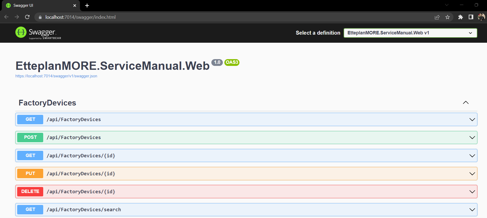

## Testing All Endpoints

### Get all maintenance tasks
The following endpoint is to get all maintenance tasks from the database. It needs to no argument as shown below: 
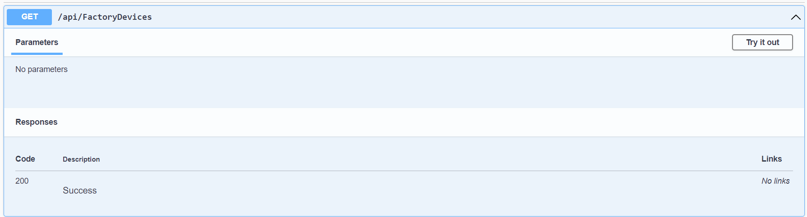
It returns list of all maintenance tasks in the response below.
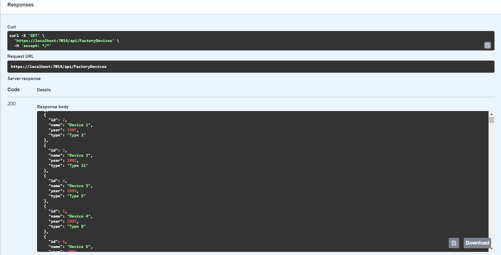

### Create maintenance task
In order to create a new maintenance task, we need to pass name, year, and type (id is ignored). 
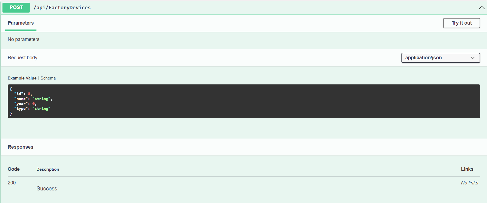
On successful entry to the database, the item is returned as response with new id.
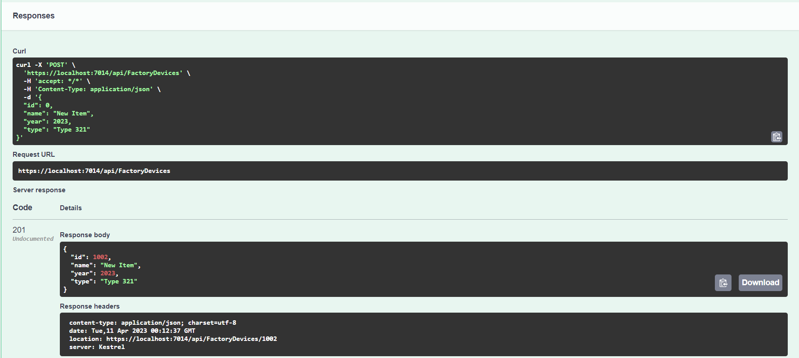

### Get maintenance task by id
This endpoint is used to get maintenance task by id.
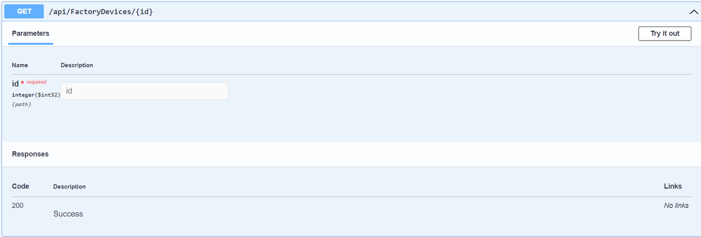
We get the item details in response. As Id is unique, we get only one record as a result.
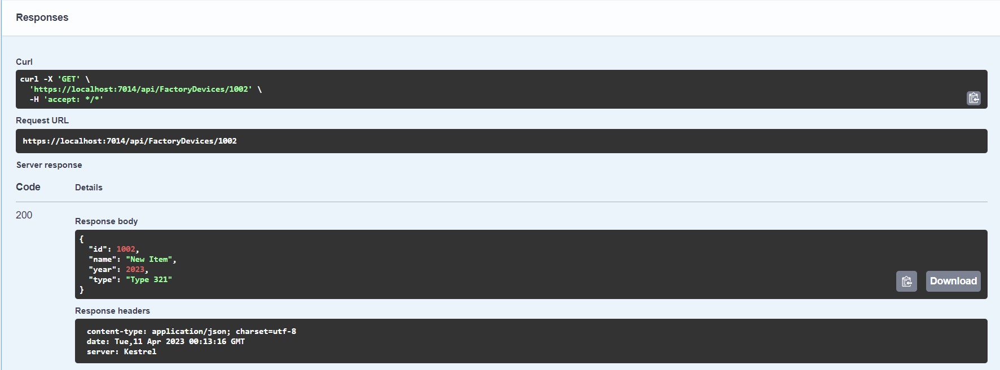

### Update maintenance task
We can update the name, year, and type (Not id) by using this endpoint. We need to pass id of the item in query string while the updated data in body.
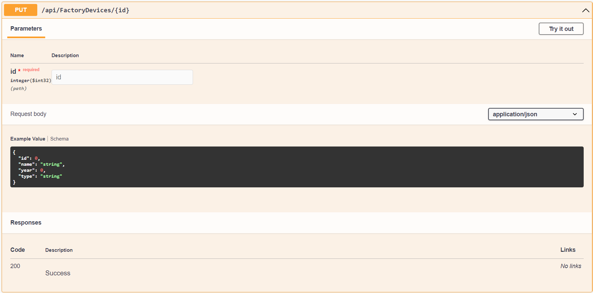
We get status code 204 if the id is found meaning that the item is updated. Otherwise, not found (404) error is returned.
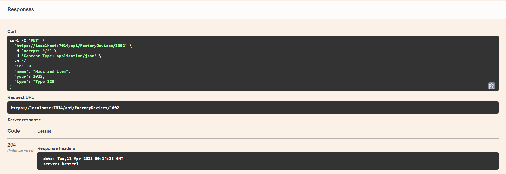

### Delete maintenance task
We can delete an item by passing its id. We get status code 204 if the id is found meaning that the item is deleted. Otherwise, not found (404) error is returned.
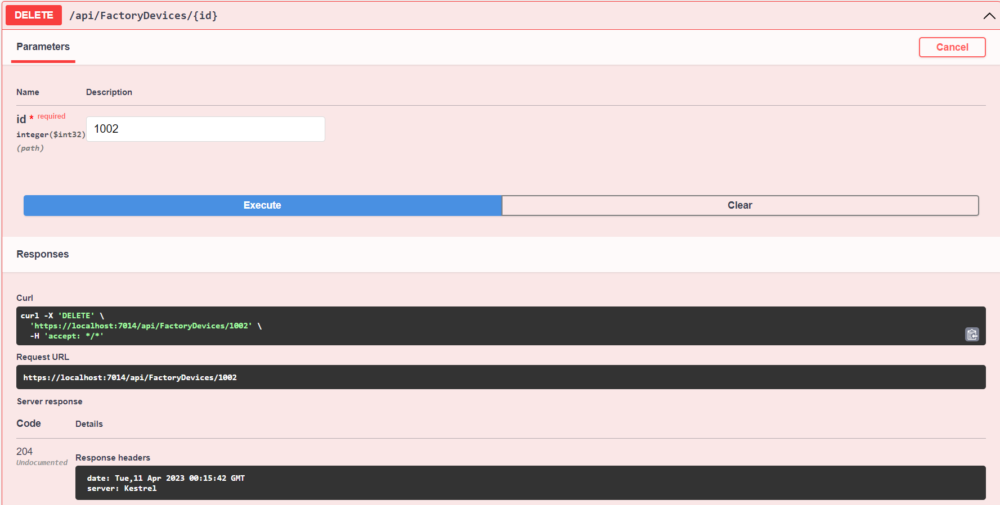

### Search maintenance task by type
We can search the devices by passing its type in  the query string.
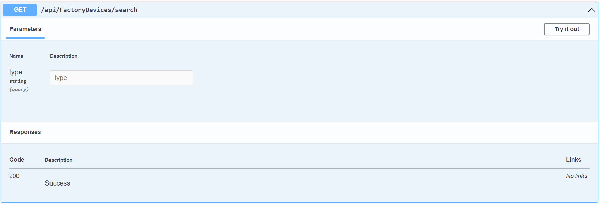
Device with 'Type 123' cannot be found now in the database.
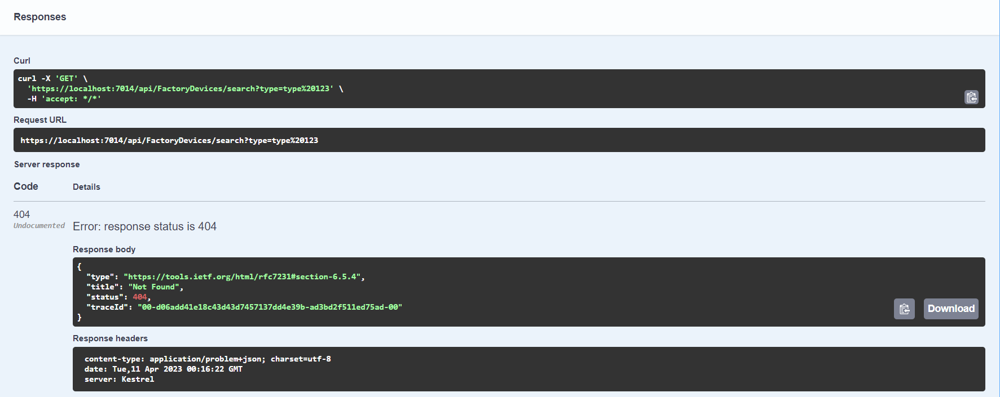
However, finding any other device type can be done as (for example 'Type 12'):
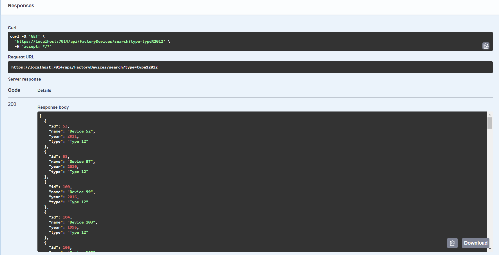
